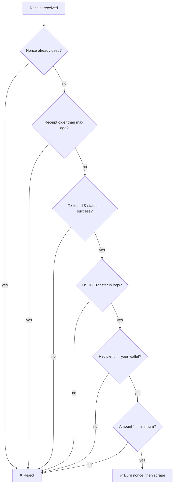

# Pay Per Scrape 💸🕷️

> **A pay-per-use web scraper for AI agents.** Send a URL plus an **x402 USDC payment receipt**, and the Actor verifies the payment **on-chain (Base)** before returning clean, scraped page content. No API keys, no subscriptions — agents pay per request in stablecoins.

<p>
  
  
  
  
  
  
</p>

---

## What does Pay Per Scrape do?

**Pay Per Scrape** turns a normal web scraper into a **paid API that settles in crypto**. Instead of authenticating with an account, the caller (typically an **AI agent**) attaches proof of a **[USDC](https://www.circle.com/usdc) payment** made on the **[Base](https://base.org)** network using the **[x402 payment protocol](https://www.x402.org/)**. The Actor independently re-verifies that payment **directly against the blockchain** — it never trusts the caller's claims — and only then scrapes the requested URL and returns the page's text.

This makes it ideal for **agent-to-agent commerce**, where an autonomous agent needs data *right now* and can pay for exactly one request without human sign-up.

Running it on the **[Apify platform](https://apify.com)** gives you API access, scheduling, monitoring, proxy rotation, and integrations out of the box.

## Why use Pay Per Scrape?

- 🤖 **Built for AI agents** — machine-payable, no accounts or API keys to manage.
- 🔒 **Trustless verification** — payment amount, recipient, and success are read straight from the chain, not from the request body.
- ♻️ **Replay-proof** — every payment receipt (nonce) can be spent **once**; reused receipts are rejected.
- ⏱️ **Freshness enforced** — stale receipts (older than a configurable window) are refused.
- ⚡ **Fast & cheap** — uses HTTP + Cheerio scraping (no headless browser) for low latency and low cost.
- 🧩 **Composable** — pipe the output into any Apify integration (Make, Zapier, webhooks, the API).

## How it works

```mermaid
sequenceDiagram
    participant Agent as AI Agent
    participant Base as Base blockchain
    participant Actor as Pay Per Scrape Actor
    participant Site as Target website

    Agent->>Base: 1. Send USDC payment (x402)
    Base-->>Agent: 2. Transaction hash + receipt
    Agent->>Actor: 3. Run with { url, receipt }
    Actor->>Actor: 4. Nonce unused? Receipt fresh?
    Actor->>Base: 5. Fetch tx receipt, decode USDC Transfer
    Base-->>Actor: 6. Real payer / amount / recipient
    Actor->>Actor: 7. Recipient == wallet? Amount >= min?
    Actor->>Site: 8. Scrape the URL (Cheerio)
    Site-->>Actor: 9. HTML
    Actor-->>Agent: 10. Clean text + payment metadata
```

### Verification checks (all must pass)



> **Why burn the nonce *before* scraping?** If the scrape crashes after payment, the receipt is already spent — a crash can't be turned into a free retry. The agent simply pays again with a fresh receipt.

## How to use Pay Per Scrape

1. **Configure your wallet.** Set the environment variables (see [Configuration](#configuration)) so the Actor knows which wallet must receive payment and the minimum acceptable amount.
2. **Have your agent pay.** The agent sends USDC on Base to your wallet and captures the transaction hash and a receipt.
3. **Call the Actor** with the target `url` and the payment `receipt`.
4. **Get your data.** On success, the scraped text and payment metadata are written to the dataset and key-value store. On failure, an error result is returned and no data is scraped.

### Run locally

```bash
apify run
```

## Input

The Actor expects a JSON input with a **`url`** to scrape and a **`receipt`** proving payment.

| Field                | Type   | Description                                            |
| -------------------- | ------ | ------------------------------------------------------ |
| `url`                | string | The page to scrape once payment is verified.           |
| `receipt.txHash`     | string | On-chain transaction hash of the USDC payment.         |
| `receipt.nonce`      | string | Unique, single-use identifier for this payment.        |
| `receipt.timestamp`  | number | Unix seconds when the receipt was created (freshness). |
| `receipt.payer`      | string | Informational — the real payer is read on-chain.       |
| `receipt.amount`     | string | Informational — the real amount is read on-chain.      |
| `receipt.recipient`  | string | Informational — the real recipient is read on-chain.   |

### Example input

```json
{
  "url": "https://example.com/article",
  "receipt": {
    "txHash": "0xabc123...def",
    "nonce": "unique-request-id-001",
    "timestamp": 1752048000,
    "payer": "0xAgentWalletAddress",
    "amount": "1000000",
    "recipient": "0xYourWalletAddress"
  }
}
```

## Output

On success, one item is pushed to the **dataset** and a `result` record is written to the **key-value store**. You can download the dataset in various formats such as **JSON, HTML, CSV, or Excel**.

### Example dataset item

```json
{
  "url": "https://example.com/article",
  "payer": "0xAgentWalletAddress",
  "amountUsdc": "1.000000",
  "txHash": "0xabc123...def",
  "nonce": "unique-request-id-001",
  "scrapedAt": "2026-07-09T12:00:00.000Z",
  "contentLength": 7421
}
```

The full scraped text (up to 8,000 characters) is stored under the `result` key in the key-value store.

### Output fields

| Field           | Description                                          |
| --------------- | ---------------------------------------------------- |
| `url`           | The URL that was scraped.                            |
| `payer`         | Wallet that actually paid, read from the blockchain. |
| `amountUsdc`    | Amount paid, in USDC.                                |
| `txHash`        | Payment transaction hash.                            |
| `nonce`         | The single-use receipt identifier.                   |
| `scrapedAt`     | ISO timestamp of the scrape.                         |
| `contentLength` | Number of characters of text extracted.              |

## Configuration

Set these as **environment variables** (or Apify secrets) for your Actor:

| Variable                  | Default     | Description                                             |
| ------------------------- | ----------- | ------------------------------------------------------ |
| `WALLET_ADDRESS`          | *(required)*| The wallet that must receive payment.                  |
| `MIN_PAYMENT_USDC`        | `1000000`   | Minimum payment in USDC base units (6 decimals → 1 USDC). |
| `MAX_RECEIPT_AGE_SECONDS` | `300`       | How old a receipt may be before it's rejected.         |

> USDC uses 6 decimals, so `1000000` base units = **1.00 USDC**.

## Pricing / cost estimation

Two costs are involved:

- **The payment itself** — set by you via `MIN_PAYMENT_USDC` (e.g. 1 USDC per scrape), paid by the caller in stablecoins on Base (gas on Base is a fraction of a cent).
- **Apify compute** — because scraping uses lightweight HTTP + Cheerio (no browser), each run consumes minimal compute units. See [Apify pricing](https://apify.com/pricing) and the free monthly tier.

## Tips & advanced options

- **Tune your price** with `MIN_PAYMENT_USDC` to match the value of the data you serve.
- **Tighten freshness** by lowering `MAX_RECEIPT_AGE_SECONDS` to reduce the replay window.
- **Add proxies** via Apify Proxy for anti-bot protection on tougher targets.
- **Scale content** by adjusting the 8,000-character slice in `src/main.ts` if you need more or less text per page.

## Tech stack

- **[Apify SDK](https://docs.apify.com/sdk/js/)** — Actor runtime, storage, and lifecycle.
- **[Crawlee](https://crawlee.dev/) (CheerioCrawler)** — fast HTTP-based scraping.
- **[viem](https://viem.sh/)** — reads and decodes the on-chain USDC `Transfer` event on Base.

## Deploy to Apify

### Connect a Git repository to Apify

1. Go to the [Actor creation page](https://console.apify.com/actors/new).
2. Click **Link Git Repository** and point it at `https://github.com/mostafaibrahim17/pay-per-scrape`.

### Push from your local machine

1. Log in (you'll need your [Apify API Token](https://console.apify.com/account/integrations)):

    ```bash
    apify login
    ```

2. Deploy and build on the Apify platform:

    ```bash
    apify push
    ```

## FAQ, disclaimer & support

**Is web scraping legal?** Scraping publicly available data is generally permitted, but you are responsible for respecting each target site's Terms of Service, robots.txt, and applicable laws. Do not use this Actor to collect personal or copyrighted data without permission.

**What if payment verification fails?** The Actor returns an error result and does **not** scrape — no partial work, no charge of your compute beyond the quick check.

**Which chains/tokens are supported?** Currently **USDC on Base**. Support for other chains/tokens would require extending the verification logic.

**Found a bug or want a feature?** Open an issue on the [GitHub repository](https://github.com/mostafaibrahim17/pay-per-scrape) or the Actor's **Issues** tab.

## Documentation reference

- [Apify SDK for JavaScript](https://docs.apify.com/sdk/js)
- [Apify Platform documentation](https://docs.apify.com/platform)
- [Crawlee documentation](https://crawlee.dev/)
- [x402 payment protocol](https://www.x402.org/)
- [Join the Apify developer community on Discord](https://discord.com/invite/jyEM2PRvMU)
